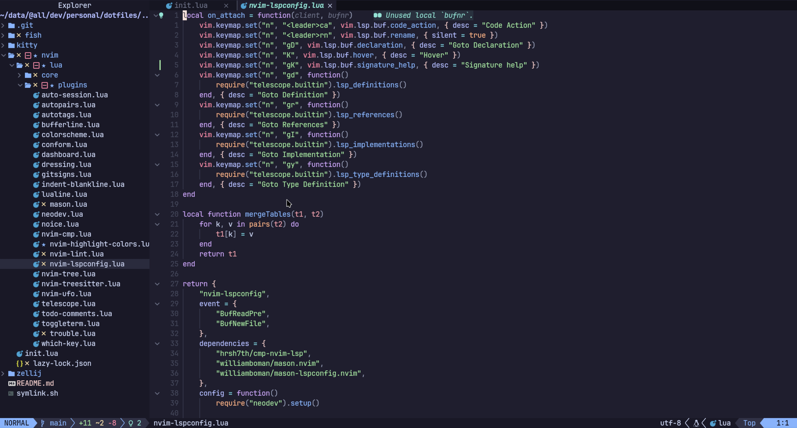
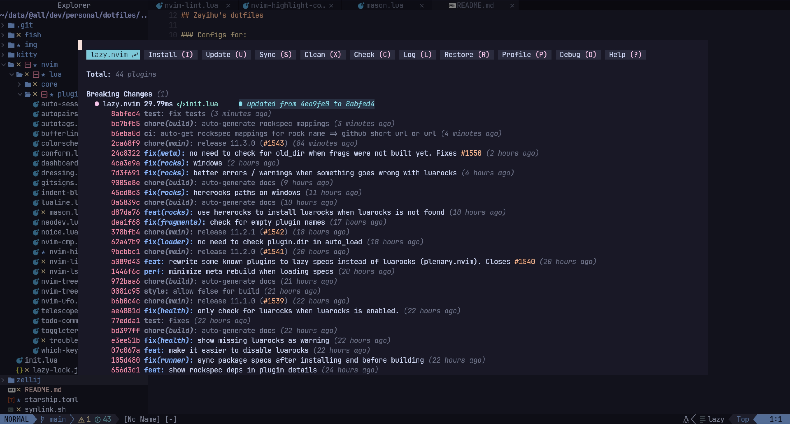

## ☂️ Zayihu's dotfiles

### 🍃 Configs for:
- Neovim - IDE and text editor
- Fish - shell
- Kitty - terminal emulator
- Starship - beautiful shell prompt
- Zellij - terminal multiplexer

Bash script for symlinking to ./home/.config

🎨 Nvim screenshots:

### Credits

folke's  for amazing source of inspiration.

